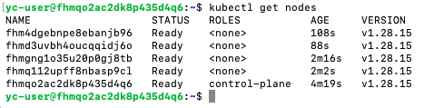

# Домашнее задание к занятию «Установка Kubernetes» Савкин ИН

---

## Задание 1. Установить кластер k8s с 1 master node (kubeadm)

Кластер развёрнут в Yandex Cloud на 5 VM (1 master + 4 worker) с Ubuntu 20.04.

### Инфраструктура

Создание сети и подсети:
```bash
yc vpc network create --name k8s-network

yc vpc subnet create \
  --name k8s-subnet \
  --network-name k8s-network \
  --zone ru-central1-a \
  --range 192.168.10.0/24
```

Создание VM:
```bash
# Master нода
yc compute instance create \
  --name master-1 \
  --zone ru-central1-a \
  --cores 2 \
  --memory 4 \
  --create-boot-disk image-folder-id=standard-images,image-family=ubuntu-2004-lts,size=20 \
  --network-interface subnet-name=k8s-subnet,nat-ip-version=ipv4 \
  --ssh-key ~/.ssh/id_rsa.pub

# Worker ноды
for i in 1 2 3 4; do
  yc compute instance create \
    --name worker-$i \
    --zone ru-central1-a \
    --cores 2 \
    --memory 4 \
    --create-boot-disk image-folder-id=standard-images,image-family=ubuntu-2004-lts,size=20 \
    --network-interface subnet-name=k8s-subnet,nat-ip-version=ipv4 \
    --ssh-key ~/.ssh/id_rsa.pub \
    --async
done
```

### Подготовка каждой ноды

На каждой ноде (master + все worker):

```bash
# Отключаем swap
sudo swapoff -a
sudo sed -i '/ swap / s/^\(.*\)$/#\1/g' /etc/fstab

# Загружаем модули ядра
cat <<EOF | sudo tee /etc/modules-load.d/k8s.conf
overlay
br_netfilter
EOF

sudo modprobe overlay
sudo modprobe br_netfilter

# Настраиваем sysctl
cat <<EOF | sudo tee /etc/sysctl.d/k8s.conf
net.bridge.bridge-nf-call-iptables  = 1
net.bridge.bridge-nf-call-ip6tables = 1
net.ipv4.ip_forward                 = 1
EOF

sudo sysctl --system

# Устанавливаем containerd
sudo install -m 0755 -d /etc/apt/keyrings
curl -fsSL https://download.docker.com/linux/ubuntu/gpg | sudo gpg --dearmor -o /etc/apt/keyrings/docker.gpg
sudo chmod a+r /etc/apt/keyrings/docker.gpg
echo "deb [arch=$(dpkg --print-architecture) signed-by=/etc/apt/keyrings/docker.gpg] https://download.docker.com/linux/ubuntu $(lsb_release -cs) stable" | sudo tee /etc/apt/sources.list.d/docker.list > /dev/null
sudo apt-get update
sudo apt-get install -y containerd.io

sudo mkdir -p /etc/containerd
containerd config default | sudo tee /etc/containerd/config.toml
sudo sed -i 's/SystemdCgroup = false/SystemdCgroup = true/' /etc/containerd/config.toml
sudo systemctl restart containerd
sudo systemctl enable containerd

# Устанавливаем kubeadm, kubelet, kubectl
curl -fsSL https://pkgs.k8s.io/core:/stable:/v1.28/deb/Release.key | sudo gpg --dearmor -o /etc/apt/keyrings/kubernetes-apt-keyring.gpg
echo 'deb [signed-by=/etc/apt/keyrings/kubernetes-apt-keyring.gpg] https://pkgs.k8s.io/core:/stable:/v1.28/deb/ /' | sudo tee /etc/apt/sources.list.d/kubernetes.list
sudo apt-get update
sudo apt-get install -y kubelet kubeadm kubectl
sudo apt-mark hold kubelet kubeadm kubectl
```

### Инициализация master ноды

```bash
sudo kubeadm init \
  --apiserver-advertise-address=192.168.10.21 \
  --pod-network-cidr=10.244.0.0/16 \
  --cri-socket=unix:///var/run/containerd/containerd.sock

# Настройка kubectl
mkdir -p $HOME/.kube
sudo cp -i /etc/kubernetes/admin.conf $HOME/.kube/config
sudo chown $(id -u):$(id -g) $HOME/.kube/config

# Установка сетевого плагина Flannel
kubectl apply -f https://raw.githubusercontent.com/flannel-io/flannel/master/Documentation/kube-flannel.yml
```

### Подключение worker нод

```bash
sudo kubeadm join 192.168.10.21:6443 --token oliqcb.vl2yc48pe8g7ifiz \
  --discovery-token-ca-cert-hash sha256:703b66e0314c63140568b4ff68cf3513be2bd0204223da94504ae6ce320e0c27
```

### Результат — все 5 нод в статусе Ready



```
NAME                   STATUS   ROLES           AGE     VERSION
fhmqo2ac2dk8p435d4q6   Ready    control-plane   4m19s   v1.28.15
fhmgng1o35u20p0gj8tb   Ready    <none>          2m16s   v1.28.15
fhmq112upff8nbasp9cl   Ready    <none>          2m2s    v1.28.15
fhm4dgebnpe8ebanjb96   Ready    <none>          108s    v1.28.15
fhmd3uvbh4oucqqidj6o   Ready    <none>          88s     v1.28.15
```

---

## Задание 2*. Установить HA кластер (kubespray)

*В процессе выполнения, появились сложности, если выполню дополню*
